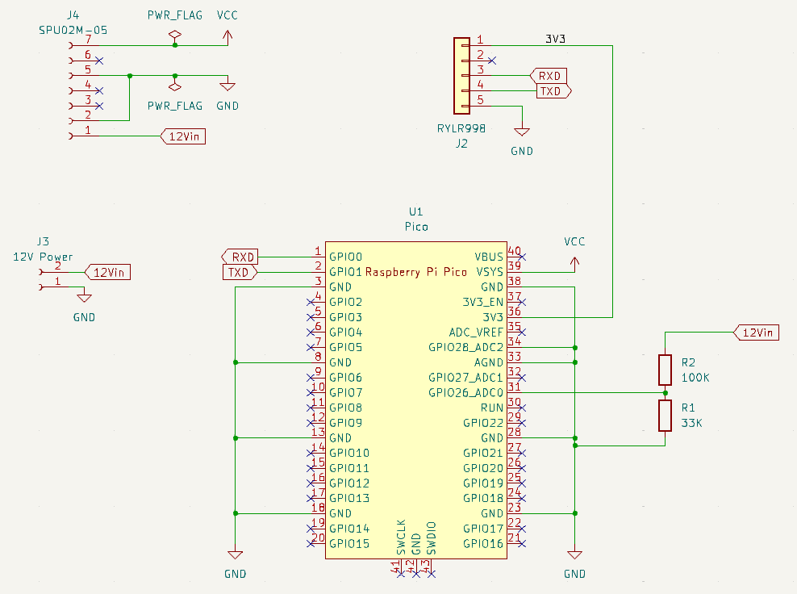
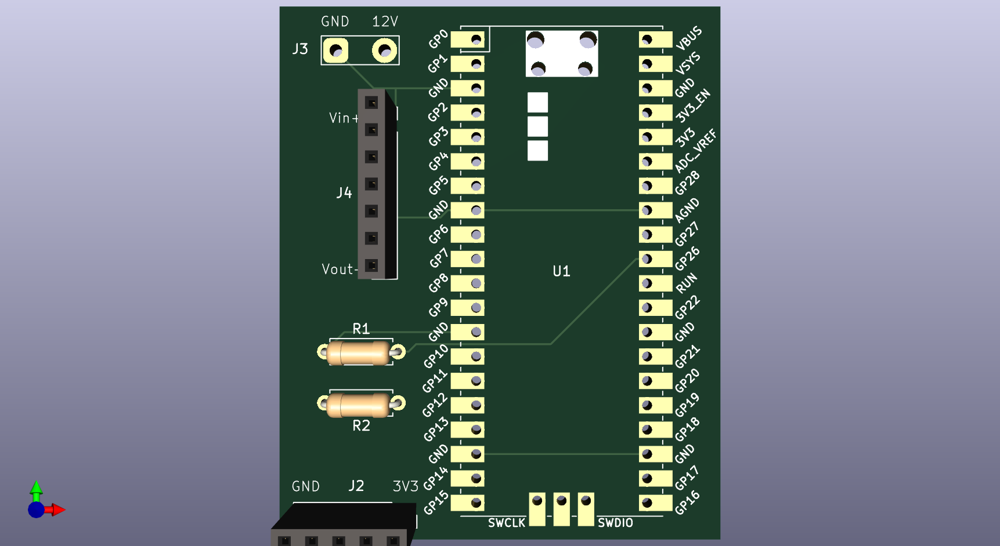
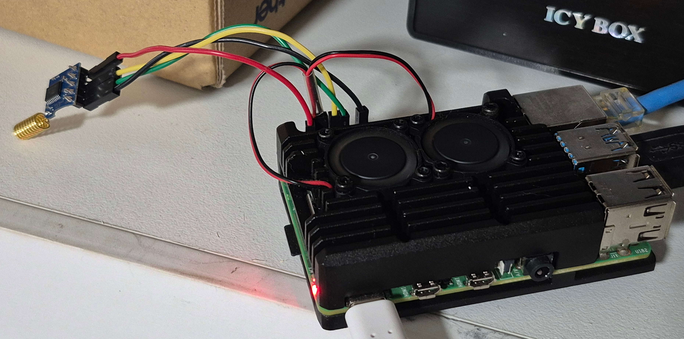

# pico_lora_sensor
A remote sensor using a Raspi Pico and a LoRa module.

If you wish to do remote sensing and you have either 12V or 5V power, then this might be a project that you can adapt for your own use case.

## My Use Case

I have three solar-powered horse waterers several hundred metres away from my house. The 12V lead-acid battery on each one dies periodically, and I wanted a way to monitor them. The distance is too far for WiFi, so this project uses a Raspberry Pi Pico and a LoRa module to send the voltage data back to a Raspberry Pi, which has its own LoRa module.

## Sensor Hardware

Here is the hardware for each battery sensor:

  * A Raspberry Pi Pico 2
  * An RYLR998 LoRa module
  * An SPU02M-05 DC-DC converter: 12V to 5V @ 400mA
  * 33K and 100K resistors to divide the 12V battery voltage down to be in the 3.3V range of the ADC on the Pico 2.
  * A printed circuit board for the components.
  * Some wire to connect the PCB to the battery, which provides both the power for the sensor and the voltage to sense.
  * A waterproof box to hold the PCB.

I've actually used pin headers so that I don't have to solder the Pico 2 and the LoRa module directly to the PCB.

The Zip file in the [Kicad](Kicad/) directory holds the KiCaD 8 project files for the circuit and the PCB.

## Circuit and PCB

Here are images of the circuit and the PCB.





## Sensor Software

In the `sensor` directory you will find:

  * [voltage_read.py](sensor/voltage_read.py) which is a standalone program you can run to read from ADC0 and print its value out,
  * [battery_sensor.py](sensor/battery_sensor.py) which is the program which the Pico runs when it is deployed out in the field, and
  * [config_batt.py](sensor/config_batt.py) which is a configuration file for the `battery_sensor.py` program. In this file, you need to set a different `voltid` value for each sensor.

To set up each Pico to be a sensor, firstly you need to install the MicroPython software on the Pico.

With this done, use `Thonny` to copy `battery_sensor.py` to the Pico but **ensure** that you rename it to be `main.py`. This makes the Pico load and run this script when it gets powered up. Also copy `config_batt.py` over to the Pico, making sure that you change the `voltid` value in the file.

You should now be able to connect the Pico to either a 5V USB power supply or a 12V power supply (but not both at the same time). It will start running the `main.py` script and send the ADC value using LoRa out to the receiver.

## Specific Sensor Functions

When I originally started this project, I tried to use UDP over WiFi. I've left the original UDP code in the `config_batt.py` script but commented out.

If you want to use this script as a basis for your own project, you might want to look at these functions:

  * `read_voltage()` reads and gets an average ADC0 value,
  * `send_command()` sends a command to the RYLR998 module,
  * `init_lora_comms()` initialises the RYLR998 module, and
  * `send_lora_voltage()` sends the ADC0 value to the receiver.

The main function in the script essentially does this:

```
# Connect to the UART
uart = machine.UART(0, baudrate=115200, tx=machine.Pin(0), rx=machine.Pin(1))

# Initialise the LoRa module
init_lora_comms()

# Loop getting sensor data
while True:

    # Get a reading from the ADC
    value= read_voltage()

    # Send it to the server via LoRa
    send_lora_voltage(value)

    # Sleep for 1 minute before sending the next update
    time.sleep(60)
```

## Sensor Calibration

The ADC on the Pico 2 (and the original Pico) is noise sensitive, so in the sensor software I:

  * set the switch-mode power supply pin high before sampling from the ADC to reduce noise,
  * connect ADC2 to ground, sample from ADC0 and subtract the ADC2 value from ADC0 to try to remove any zero offset, and
  * sample many times (one hundred times, actually) and average the results to reduce noise.

The sensor sends the averaged ADC value via LoRa and the receiver converts this to a voltage value. Each sensor needs to be calibrated, so I do this once the sensor is built and the software is loaded:

 1. Plug the Pico in to USB to get a working 5V power supply.
 2. Connect the 12V and ground wires together. The sensor will now transmit the ADC value for zero volts back to the receiver. Write this down.
 3. Disconnect the USB, separate the 12V and ground wires and connect the sensor to a 12V battery.
 4. The sensor will now transmit the ADC value of this voltage. Use a multimeter to measure this voltage. Look at the ADC value at the receiver and write down this value and the voltage it represents.

As an example, one of my sensors reads 0V as ADC0 value 12700 and 12.8V as ADC0 value 37384.

## Example Sensor Output

Each sensor sends a data packet with four colon-separated ASCII values:

 1. The word "voltage",
 2. An incrementing counter value, so that the server knows if it receives old data,
 2. The identity of the sensor (i.e. the `voltid` configuration value), and
 3. The averaged ADC0 value.

This data is sent three times, just in case one of the LoRa transmissions doesn't make it to the server.

As an example, sensor 3 recently sent this data: `voltage:8151:3:35377.28`.

The data is wrapped up in a LoRa data frame which has comma-separated fields. When it is received, it looks something like this:

```
2,18,voltage:2:2:5537.0,-48,10
```

The comma-separated fields are:

  * Transmitter Address ID,
  * Data Length,
  * Data in ASCII,
  * Received Signal Strength Indicator,
  * Signal-to-noise ratio

The above example shows transmitter 2 sending a data payload of 18 bytes, with an RSSI of -48 and a SNR of 10.

## Receiver Hardware

I'm using a Raspberry Pi 4 as the receiver, along with an RYLR998 LoRa module. It is wired in like this:



  * RYLR998 ground goes to Pi pin 6 (i.e. GND)
  * RYLR998 TX goes to Pi pin 10 (i.e. UART RX)
  * RYLR998 RX goes to Pi pin 8 (i.e. UART TX)
  * RYLR998 VDD goes to Pi pin 1 (i.e. 3.3V)

## Receiver Configuration

You need to enable the GPIO UART on the Raspberry Pi. There are several ways to do this, but the easiest is to edit the file `/boot/config.txt` and add these lines:

```

[all]
enable_uart=1
```

then reboot the Pi so that they take effect.

## Receiver Software

The receiver code is in the [receiver](receiver/) directory.

I'm an old guy, so I wrote the receiver in Perl instead of Python. You probably won't want to use the receiver code, but look in the file [tankserver.pl](receiver/tankserver.pl) for these functions:

  * `send_lora_command()` which sends commands to the RYLR998 module,
  * `recv_lora_data()` which receives data frames from the RYLR998 module, and
  * `init_lora()` which initialises the GPIO UART and the attached RYLR998 module.

If you do want to use the receiver code as-is, you will need to run the `create_battery_files` shell script to create the two files that store the received sensor data. One is an Sqlite3 database and the other is an RRDtool database.

Thus, you will probably need to install these dependencies: sqlite3, rrdtool, plus these Perl packages: Proc::Daemon, Logger::Syslog, Time::HiRes, and RRDs.

As with the sensor code, I've left the old UDP receiving code in the `tankserver.pl` script but it is commented out.

## Other Documentation

In the [docs](docs/) directory I've left the datasheets for the RYLR998 module and the SPU02M-05 DC-DC converter.


